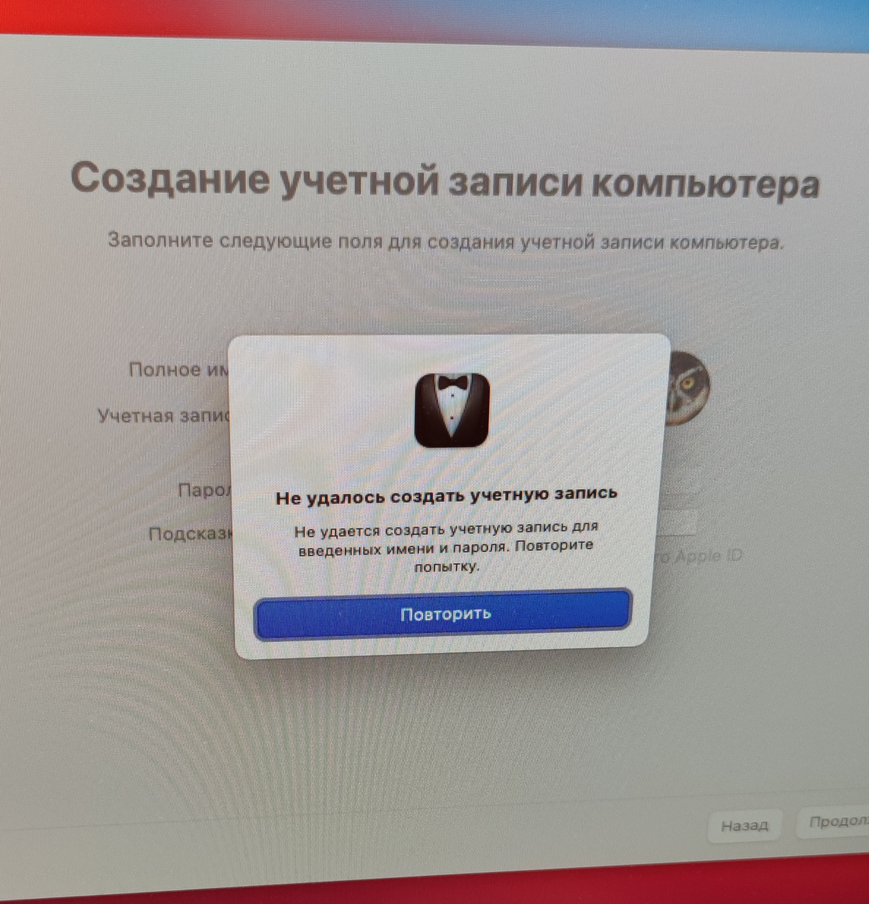
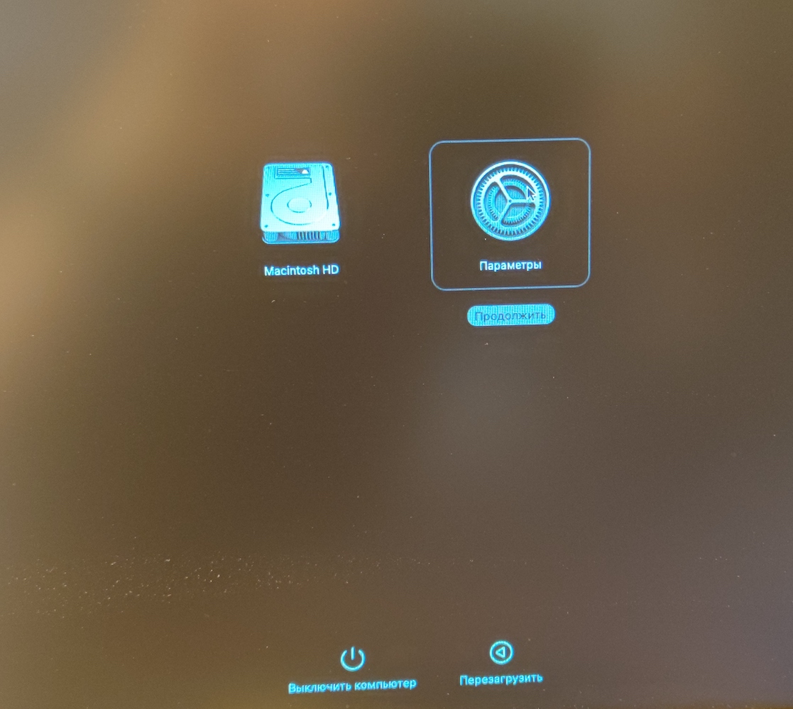
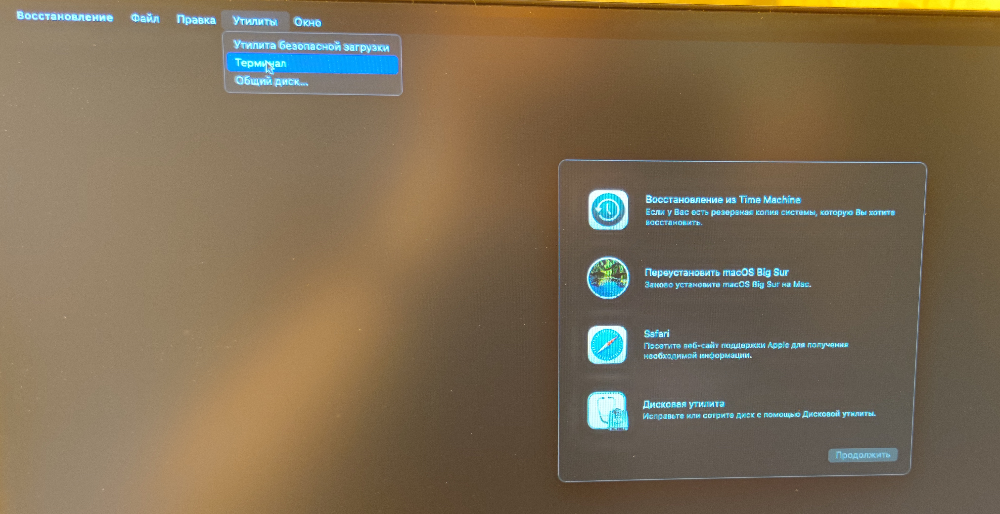
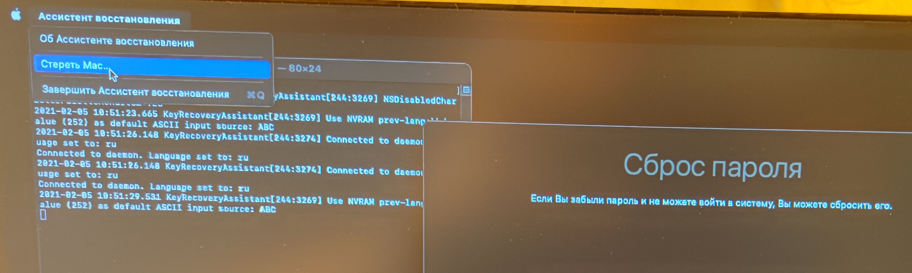

# Проблемы
Здесь я постараюсь описывать пролемы с которыми я сталкиваюсь, и их решения

# Mac Mini 2020 (M1 Apple Silicon processor)

# Не могу создать учетную запись Mac OS Big Sur 11.2 после переустановки, ошибка:
После стирания диска и переустановки системы из режима восстановления все идет хорошо до момента создания новой учетной записи MAC OS
После ввода данных для создания новой учетной записи после переустановки окно зависает на несколько минут, затем появляется ошибка:
## Не удалось создать учетную запись
### Не удается создать учетную запись для введенных имени и пароля. Повторите попытку.

После перезагрузки учетная запись появляется, но ни один пароль к ней не подходит.

Команда resetpassword в терминале в режиме восстановления также не позволяет сбросить пароль.

Переустанавливал много раз с различными паарметрами, ничего не помогало

# Решение
## Необходимо подключение к интернету
Зайдите в режим восстановления (выключаем Mac mini, затем держим кнопку питания пока не увидите варианты загрузки, выбираем "параметры")

### !НЕ УВЕРЕН!
Сомневаюсь, что это необходимо, но я так делал: заходим в утилиту дисков и стираем диски (Macintosh HD и Macintosh HD Data)

Закрываем утилиту дисков и выбираем в меню сверху утилиты -> терминал

Вводим resetpassword

Выбираем в верхнем меню "Ассистент восстановления" -> стереть  Mac

После этого система еще раз полностью переустановится. Проблема после этого решилась.
